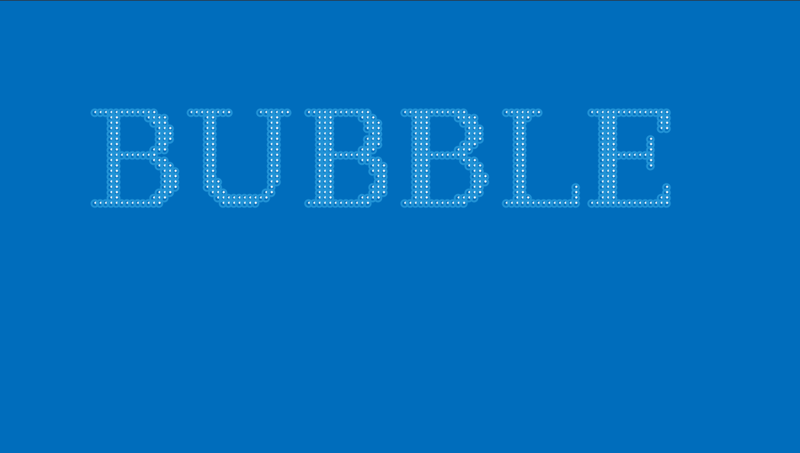

# Bubbletext

## A Brief description

Сценарий эффекта разработан на чистом яваскрипт. Под капотом использует Canvas API и Web API (методы предоставляемые браузером).
В данном скрипте - `window.requestAnimationFrame`, предоставляет разработчикам доступ к жизненному циклу фрейма,
позволяя выполнять операции перед вычислением стилей и формированием макета (layout) документа браузером.
Тесно связан с циклом событий (event loop) браузера.

## Install and Usage

Скачать архив и распаковать его. Далее, открыть индексный файл (index.html) в любом браузере. Готово!!!
Или просто перейти по _[ссылке](https://alekstar79.github.io/bubbletext)_ и увидеть результат работы скрипта.

